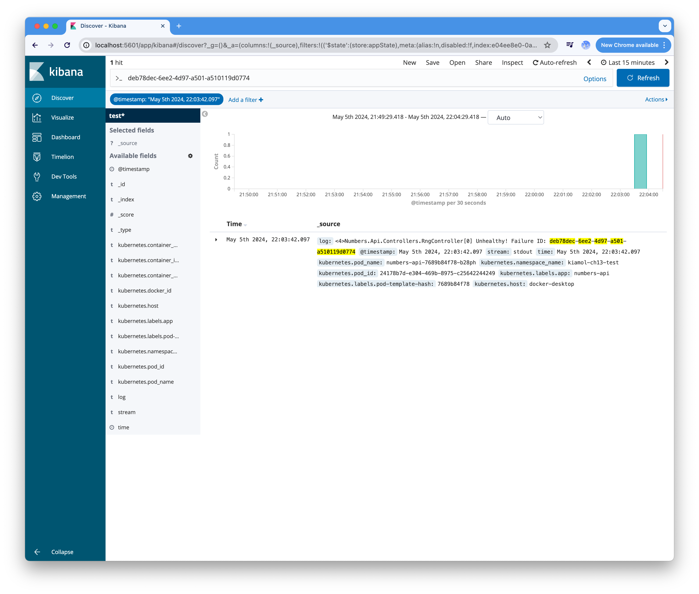

## 13장 Fludentd 와 ElasticSearch 를 이용한 중앙화된 로그 관리

**Fluentd** 
- An open source data collector for unified logging layer.
- 로그 수집

**ElasticSearch**
- A distributed, RESTful search and analytics engine capable of addressing a growing number of use cases.
- 로그 저장

**Kibana**
- A browser-based analytics and search dashboard for Elasticsearch.
- 로그 필터링 및 검색 UI 

### 13.1 쿠버네티스의 로그 관리 

1. 컨테이너 런타임이 로그를 수집하여, 컨테이너를 실행 중인 노드에 파일 형태로 저장 
2. 로그 관리 시스템 
- 노드에 쌓인 로그를 수집 (e.g FluentD)
- 중앙화된 저장소에 전달 (e.g ElasticSearch)
- UI를 통해 로그에 대한 필터링 및 검색 기능 (e.g Kibana)

> timecheck 애플리케이션을 또 다른 네임스페이스에 설정을 바꾸어 배치하라. 그리고 kubectl 로 로그를 직접 살펴보아라.

```
# timecheck application 을 개발, 테스트 네임스페이스에 배치
kubectl apply -f timecheck/

//
namespace/kiamol-ch13-dev created
deployment.apps/timecheck created
namespace/kiamol-ch13-test created
configmap/timecheck-config created
deployment.apps/timecheck created

# 개발 네임스페이스의 애플리케이션이 준비될 때까지 대기
kubectl wait --for=condition=ContainersReady pod -l app=timecheck -n kiamol-ch13-dev

//
pod/timecheck-5fc4bfdcc8-b2kw5 condition met

# 로그를 확인
kubectl logs -l app=timecheck --all-containers -n kiamol-ch13-dev --tail 1

//
2024-05-05 10:25:52.304 +00:00 [INF] Environment: DEV; version: 1.0; time check: 10:25.52

# 테스트 네임스페이스의 애플리케이션이 준비될 때까지 대기
kubectl wait --for=condition=ContainersReady pod -l app=timecheck -n kiamol-ch13-test

//
pod/timecheck-7b8c8569c7-47ww7 condition met
pod/timecheck-7b8c8569c7-68vsp condition met

# 로그를 확인
kubectl logs -l app=timecheck --all-containers -n kiamol-ch13-test --tail 1

//
2024-05-05 10:26:06.722 +00:00 [INF] Environment: TEST; version: 1.1; time check: 10:26.06
2024-05-05 10:26:04.812 +00:00 [INF] Environment: TEST; version: 1.1; time check: 10:26.04
```

> 호스트의 로그 파일 디렉터리를 마운트한 파드를 실행하라. 그리고 이 파드로 로그 파일을 살펴보아라.

```
# sleep 디플로이먼트를 배치
kubectl apply -f sleep.yaml

//
deployment.apps/sleep created

# 파드 컨테이너와 터미널 세션 연결
kubectl exec -it deploy/sleep -- sh

# 호스트 로그 파일 마운트 경로 이동
cd /var/log/containers/

# timecheck 애플리케이션의 로그 파일 확인
ls timecheck*kiamol-ch13*_logger*

//
timecheck-5fc4bfdcc8-b2kw5_kiamol-ch13-dev_logger-d5b9c232cd61428574a2cd31618f2a4d301c356f0d21ff010c25e4ea107eb34a.log
timecheck-7b8c8569c7-47ww7_kiamol-ch13-test_logger-cf116e4c136e5e41bd6ebbb6e9a57ac8ddc361a23f55e47799da96f7b94b4626.log
timecheck-7b8c8569c7-68vsp_kiamol-ch13-test_logger-86ec22cd34dbbe5dd9fe0e474c40610e506bcc1714fd6c26de0f2e7b409ca8e6.log

# 개발 네임스페이스의 로그 파일 내용 확인
cat $(ls timecheck*kiamol-ch13-dev_logger*) | tail -n 1

//
{"log":"2024-05-05 10:30:37.293 +00:00 [INF] Environment: DEV; version: 1.0; time check: 10:30.37\n","stream":"stdout","time":"2024-05-05T10:30:38.183747382Z"}

# 터미널 세션 종료
exit
```

> 노드마다 모든 쿠버네티스 코어 컴포넌트가 실행되지는 않지만, sleep 파드로 현재 노드에서 실행되는 공통적인 코어 컴포넌트가 어떤 것이 있는지 확인할 수 있다.

```
# sleep 파드에 터미널 세션 연결
kubectl exec -it deploy/sleep -- sh

# 호스트경로 볼륨의 마운트 경로로 이동
cd /var/log/containers/

# 네트워크 프록시는 모든 노드에서 실행된다
cat $(ls kube-proxy*) | tail -n 1

//
{"log":"E0429 14:29:48.685879       1 service_health.go:187] \"Healthcheck closed\" err=\"accept tcp [::]:30072: use of closed network connection\" service=\"default/repo-chartmuseum\"\n","stream":"stderr","time":"2024-04-29T14:29:48.686262637Z"}

# 현재 노드에서 코어 DNS 를 사용 중이라면 로그를 볼 수 있다
cat $(ls coredns*) | tail -n 1

//
{"log":"linux/arm64, go1.18.2, 45b0a11\n","stream":"stdout","time":"2024-04-23T09:57:44.849805751Z"}

# 현재 노드에서 API 서버가 실행 중이라면 로그를 볼 수 있다
cat $(ls kube-apiserver*) | tail -n 1

//
{"log":"W0505 10:33:49.025162       1 watcher.go:229] watch chan error: etcdserver: mvcc: required revision has been compacted\n","stream":"stderr","time":"2024-05-05T10:33:49.025495846Z"}

# ls *.log
ls *.log

//
coredns-565d847f94-9gz9h_kube-system_coredns-2beb1cdc6b35454e0f6ba851a48f9b4f80baa70580561872454e0074926230f2.log
coredns-565d847f94-rjnlh_kube-system_coredns-08ad6dd778100d9c4000c038a1acc114003aad4972a5de35eafd8a63cc45107d.log
etcd-docker-desktop_kube-system_etcd-01c9adf57c0f8dc36d5716b8646fbbdcbcb6f32f21ed871245c4fb3b140718c6.log
kube-apiserver-docker-desktop_kube-system_kube-apiserver-ffb51e326f7fee403fda4caed46c89a6a1a8e9330a1b11247ddcb622bb341fde.log
kube-controller-manager-docker-desktop_kube-system_kube-controller-manager-505253cd92d4a0a9418c03638eb54d9528cadb6616da50d72203e27cc9ed3fb8.log
kube-proxy-2qkzx_kube-system_kube-proxy-f0bda995aadee1cffba72c61eacc4b0fce493d8d702b76ab4abfcb183e12723a.log
kube-scheduler-docker-desktop_kube-system_kube-scheduler-3d5e56d583c87110f7b5fafc027a4e2ed2bd099462514ab9017c9fad87497ddb.log
sleep-6d4bfdc8fb-gxvqz_default_sleep-0141883e30b27c02d0885044b69a2ce7b5c1884aec4ea48972fc8b3b660fc0d4.log
storage-provisioner_kube-system_storage-provisioner-d1405d5e89c78015353da286e04355fbe04159c362309c1c1025947dd866fae8.log
timecheck-5fc4bfdcc8-b2kw5_kiamol-ch13-dev_logger-d5b9c232cd61428574a2cd31618f2a4d301c356f0d21ff010c25e4ea107eb34a.log
timecheck-5fc4bfdcc8-b2kw5_kiamol-ch13-dev_timecheck-9a496c123662c99fd49fc0322ae2051f793a6657b422ba28a02ab4be744984d2.log
timecheck-7b8c8569c7-47ww7_kiamol-ch13-test_init-config-1ef619531ac43e2e3d3a3b98daeaa906a6f5e3d677fcf9c39dd5e8cc6b60064b.log
timecheck-7b8c8569c7-47ww7_kiamol-ch13-test_logger-cf116e4c136e5e41bd6ebbb6e9a57ac8ddc361a23f55e47799da96f7b94b4626.log
timecheck-7b8c8569c7-47ww7_kiamol-ch13-test_timecheck-8d30a32d00e82d71892c44bc70b8a96c6920109e3491f2095ab256d926aefb0b.log
timecheck-7b8c8569c7-68vsp_kiamol-ch13-test_init-config-f3979a7a92797be3be45c63e50fc77aa6e1aa79ab00d6a88ec16c3e6b3d486ac.log
timecheck-7b8c8569c7-68vsp_kiamol-ch13-test_logger-86ec22cd34dbbe5dd9fe0e474c40610e506bcc1714fd6c26de0f2e7b409ca8e6.log
timecheck-7b8c8569c7-68vsp_kiamol-ch13-test_timecheck-357a2f325ac6048e9c88611f447fda6336f9da87067bcef1614d5213736e1932.log
vpnkit-controller_kube-system_vpnkit-controller-89ca11ef51009cac96ac324cc05d9f2342d3736edc2efa353211745e3e9ba27d.log
vpnkit-controller_kube-system_vpnkit-controller-ebb7af397ccf4ca7d6ed398739b21c7562c1ad5f7ddeb2d60098c9d7791ded59.log


# 터미널 세션 종료
exit
```

### 13.2 FluentD 를 이용한 로그 파일 수집

**Fluent Bit**
- A fast Log Processor and Forwarder for Linux, Windows, Embedded Linux, MacOS and BSD family operating systems

Fluent Bit 를 쿠버네티스에서 구동하는 구조
    - 모든 노드에서 콜렉터 파드를 DaemonSet으로 실행
    - 파드가 로그 파일에 접근할 수 있도록 HostPath 마운트 추가

> timecheck 애플리케이션의 로그 파일을 읽어 들여 Fluent-bit 컨테이너의 표준 출력 스트림에 출력하도록 설정된 플루언트 비트를 배치

```
# 플루언트 비트를 구성하는 데몬셋과 컨피그맵 배치
kubectl apply -f fluentbit/

//
namespace/kiamol-ch13-logging created
configmap/fluent-bit-config created
daemonset.apps/fluent-bit created
serviceaccount/fluent-bit created
clusterrole.rbac.authorization.k8s.io/fluent-bit created
error: resource mapping not found for name: "fluent-bit" namespace: "" from "fluentbit/fluentbit.yaml": no matches for kind "ClusterRoleBinding" in version "rbac.authorization.k8s.io/v1beta1"
ensure CRDs are installed first

//
namespace/kiamol-ch13-logging unchanged
configmap/fluent-bit-config unchanged
daemonset.apps/fluent-bit unchanged
serviceaccount/fluent-bit unchanged
clusterrole.rbac.authorization.k8s.io/fluent-bit unchanged
clusterrolebinding.rbac.authorization.k8s.io/fluent-bit created

# 플루언트 비트가 실행될 때까지 대기
kubectl wait --for=condition=ContainersReady pod -l app=fluent-bit -n kiamol-ch13-logging

//
pod/fluent-bit-5w8jq condition met

# 플루언트 비트 파드의 로그를 확인
kubectl logs -l app=fluent-bit -n kiamol-ch13-logging --tail 2

//
{"date":1714905752.798748,"log":"2024-05-05 10:42:32.279 +00:00 [INF] Environment: DEV; version: 1.0; time check: 10:42.32\n","stream":"stdout","time":"2024-05-05T10:42:32.79874763Z"}
{"date":1714905755.471606,"log":"2024-05-05 10:42:34.790 +00:00 [INF] Environment: TEST; version: 1.1; time check: 10:42.34\n","stream":"stdout","time":"2024-05-05T10:42:35.471605589Z"}

```


```
# 예제 13-1 fluentbit-config.yaml 플루언트 비트의 로그 처리 파이프라인 정의
[INPUT]
Name    tail    # 파일의 끝부터 읽음
Tag     kube.*  # 수집된 로그에 추가할 태그 접두어
Path    /var/log/containers/timecheck*.log
Parser  docker  # JSON 으로 된 컨테이너 로그의 파서
Refresh_interval    10  # 파일 목록 확인 간격

[OUTPUT]
Name    stdout  # 표준 출력 스트림으로 출력
Format  json_lines  # 하나의 엔트리를 한 줄로 출력
Match   kube.*  # kube 로 시작하는 태그의 로그를 출력 
```

> 컨피그맵을 업데이트하여 플루언트 비트의 설정을 쿠버네티스 필터를 사용하도록 변경한다. 그리고 플루언트 비트 데몬셋을 재시작하여 변경된 설정을 적용한다. 그다음 수집된 최근 로그를 확인하여 필터링이 잘 적용되었는지 확인하라

```
# 로그 처리 파이프라인 설정이 담긴 컨피그맵을 업데이트한다
kubectl apply -f fluentbit/update/fluentbit-config-match.yaml

//
configmap/fluent-bit-config configured

# 플루언트 비트 데몬셋을 재시작하여 변경된 설정을 적용한다
kubectl rollout restart ds/fluent-bit -n kiamol-ch13-logging

//
daemonset.apps/fluent-bit restarted

# 새로운 파드가 준비될 때까지 대기
kubectl wait --for=condition=ContainersReady pod -l app=fluent-bit -n kiamol-ch13-logging

//
pod/fluent-bit-6krch condition met

# 수집된 최근 로그를 확인
kubectl logs -l app=fluent-bit -n kiamol-ch13-logging --tail 1

//
{"date":1714908517.045729,"log":"2024-05-05 11:28:36.567 +00:00 [INF] Environment: TEST; version: 1.1; time check: 11:28.36\n","stream":"stdout","time":"2024-05-05T11:28:37.045728798Z","kubernetes":{"pod_name":"timecheck-7b8c8569c7-68vsp","namespace_name":"kiamol-ch13-test","pod_id":"a3f9946f-1b69-4982-8e3c-b3a48d3e9d5d","labels":{"app":"timecheck","pod-template-hash":"7b8c8569c7"},"host":"docker-desktop","container_name":"logger","docker_id":"86ec22cd34dbbe5dd9fe0e474c40610e506bcc1714fd6c26de0f2e7b409ca8e6","container_hash":"kiamol/ch03-sleep@sha256:adfca68c9bf46862dcbd898ebadeaefee1f5a1feeb7e3a146a91acbcb3f4f9dc","container_image":"kiamol/ch03-sleep:latest"}}

```

```
# 예제 13-2 fluentbit-config-match-multiple.yaml 로그의 출력 대상을 여러 개 설정

[OUTPUT]
    Name    stdout  # 표준 출력 스트림 플러그인에
    Format  json_lines # 테스트 네임스페이스에서 생성된
    Match   kube.kiamol-ch13-test.* # 로그만 출력한다

[OUTPUT]
    Name    counter # 개발 네임스페이스에서 생성된 로그
    Match   kube.kiamol-ch13-dev.*  # 개수를 함께 출력한다
```

> 출력 대상이 여러 개가 되도록 플루언트 비트의 설정을 변경하고 플루언트 비트 파드의 로그를 화면에 출력하라
```
# 설정을 변경하고 플루언트 비트를 재시작한다
kubectl apply -f fluentbit/update/fluentbit-config-match-multiple.yaml

//
configmap/fluent-bit-config configured

kubectl rollout restart ds/fluent-bit -n kiamol-ch13-logging

//
daemonset.apps/fluent-bit restarted

# 최근 두 건의 로그를 화면에 출력한다
kubectl logs -l app=fluent-bit -n kiamol-ch13-logging --tail 2

//
1714908555.876291,2 (total = 2)
{"date":1714908555.268671,"log":"2024-05-05 11:29:14.658 +00:00 [INF] Environment: TEST; version: 1.1; time check: 11:29.14\n","stream":"stdout","time":"2024-05-05T11:29:15.268671219Z","kubernetes":{"pod_name":"timecheck-7b8c8569c7-47ww7","namespace_name":"kiamol-ch13-test","pod_id":"876dcccc-ce90-4272-a6c3-58aaf2b8bbae","labels":{"app":"timecheck","pod-template-hash":"7b8c8569c7"},"host":"docker-desktop","container_name":"logger","docker_id":"cf116e4c136e5e41bd6ebbb6e9a57ac8ddc361a23f55e47799da96f7b94b4626","container_hash":"kiamol/ch03-sleep@sha256:adfca68c9bf46862dcbd898ebadeaefee1f5a1feeb7e3a146a91acbcb3f4f9dc","container_image":"kiamol/ch03-sleep:latest"}}

```

FIX : 
AS-IS
```
apiVersion: rbac.authorization.k8s.io/v1beta1
kind: ClusterRoleBinding
```

TO-BE
```
apiVersion: rbac.authorization.k8s.io/v1
kind: ClusterRoleBinding
```

### 13.3 수집된 로그를 ElasticSearch 에 저장하기 

**ElasticSearch**
- document 단위로 데이터를 저장하며, document 가 모인 것을 Index 라고 한다
- 데이터를 저장하고 조회하는 용도로 쓰이는 REST API 를 가진 단일 컴포넌트 형태로 실행 
- Kibana 는 ElasticSearch 의 Frontend 역할

> 로그 저장소와 그 프론트엔드인 ElasticSaerch 와 Kibana 를 배치
```
# ElasticSaerch 디플로이먼트를 생성하고 파드가 준비될 때까지 대기

kubectl apply -f elasticsearch/

//
service/elasticsearch created
deployment.apps/elasticsearch created

kubectl wait --for=condition=ContainersReady pod -l app=elasticsearch -n kiamol-ch13-logging

//
pod/elasticsearch-559bdb4c7c-ctgnl condition met

# Kibana 디플로이먼트를 생성하고 파드가 준비될 때까지 대기

kubectl apply -f kibana/

//
service/kibana created
deployment.apps/kibana created

kubectl wait --for=condition=ContainersReady pod -l app=kibana -n kiamol-ch13-logging

//
pod/kibana-56f447fb86-2d99t condition met

# Kibana 에 접근할 수 있는 URL 확인

kubectl get svc kibana -o jsonpath="http://{.status.loadBalancer.ingress[0].*}:5601" -n kiamol-ch13-logging

//
http://localhost:5601
```

> ElasticSearch 에 로그를 저장하도록 Fluent-bit 설정을 변경하라. 그리고 Kibana web UI 를 통해 test 인덱스 조회를 설정하라
```
# 13-3
kubectl apply -f fluentbit/update/fluentbit-config-elasticsearch.yaml

//
configmap/fluent-bit-config configured

# fluent-bit pod 를 재시작한 후 대기 
kubectl rollout restart ds/fluent-bit -n kiamol-ch13-logging

//
daemonset.apps/fluent-bit restarted

kubectl wait --for=condition=ContainersReady pod -l app=fluent-bit -n kiamol-ch13-logging

//
pod/fluent-bit-4jncj condition met
```

> 무작위 숫자 API 를 배치한다. 이 애플리케이션은 두 번째 호출부터 오류를 일으키게 만들어졌지만 프록시를 함께 배치하면 프록시가 응답을 캐싱해 주기 때문에 거의 문제를 일으키지 않는다. API 를 호출해보고 오류가 발생하면 키바나에서 오류 식별자를 검색하라.

```
# API 와 proxy 를 배치
kubectl apply -f numbers/

//
service/numbers-api created
deployment.apps/numbers-api created
service/numbers-api-proxy created
configmap/numbers-api-proxy-config created
deployment.apps/numbers-api-proxy created

# 애플리케이션이 시작될 때까지 대기 
kubectl wait --for=condition=ContainersReady pod -l app=numbers-api -n kiamol-ch13-test

//
pod/numbers-api-7689b84f78-b28ph condition met

# Proxy 를 경유하여 API 에 접근하는 URL 을 확인
kubectl get svc numbers-api-proxy -o jsonpath='http://{.status.loadBalancer.ingress[0].*}:8080/rng' -n kiamol-ch13-test

//
http://localhost:8080/rng

//
{"message":"Unhealthy! Failure ID: deb78dec-6ee2-4d97-a501-a510119d0774"}

//
log:<4>Numbers.Api.Controllers.RngController[0] Unhealthy! Failure ID: deb78dec-6ee2-4d97-a501-a510119d0774
@timestamp:May 5th 2024, 22:03:42.097 
stream:stdout 
time:May 5th 2024, 22:03:42.097 
kubernetes.pod_name:numbers-api-7689b84f78-b28ph 
kubernetes.namespace_name:kiamol-ch13-test 
kubernetes.pod_id:24178b7d-e304-469b-8975-c25642244249 
kubernetes.labels.app:numbers-api 
kubernetes.labels.pod-template-hash:7689b84f78 
kubernetes.host:docker-desktop
```



### 13.4 로그 파싱 및 필터링하기 

fluentbit-config-parser.yaml, 애플리케이션 로그를 분석하는 사용자 정의 파서
```
[PARSER]
    Name        dotnet-syslog           # parser name
    Format      regex                   # 정규 표현식
    Regex       ^\<(?<priority>[0-9]+)\>*(?<message>.*)$
```

api-with-parser.yaml, 플루언트 비트 사용자 정의 파서 설정이 추가된 파드 정의 
```
template:
  metadata:
    labels:
      app: numbers-api
    annotations:
      fluentbit.io/parser: dotnet-syslog    # 로그를 처리하기 위해 사용할 파서 
```

> 무작위 숫자 애플리케이션과 그 앞 단의 프록시에 서로 다른 파서를 적용하도록 플루언트 비트 설정을 변경하고, 두 컴포넌트 설정에 맞추어 애너테이션을 추가한다. 그다음 애플리케이션을 사용하고 카바나에서 로그를 확인하라
```
# 로그 처리 파이프라인 설정을 변경
kubectl apply -f fluentbit/update/fluentbit-config-parser.yaml

//
configmap/fluent-bit-config configured

# 플루언트 비트를 재시작
kubectl rollout restart ds/fluent-bit -n kiamol-ch13-logging
kubectl wait --for=condition=ContainersReady pod -l app=fluent-bit -n kiamol-ch13-logging

//
daemonset.apps/fluent-bit restarted
pod/fluent-bit-mvlnl condition met

# 디플로이먼트 정의에 파서 에너테이션을 추가하고 업데이트
kubectl apply -f numbers/update/

//
deployment.apps/numbers-api configured
deployment.apps/numbers-api-proxy configured

# API 준비 대기
kubectl wait --for=condition=ContainersReady pod -l app=numbers-api -n kiamol-ch13-test

//
pod/numbers-api-6fc6f59bbb-h8l8n condition met
```

fluentbit-config-grep.yaml, 필드값을 기준으로 하는 로그 필터링
```
[FILTER]
    Name    grep    # 문자열 검색 필터 grep 을 사용한다 
    Match   kube.kiamol-ch13-test.api.numbers-api*
    Regex   priority[234] 
```
API 파드가 priority 필드값이 6인 로그를 생산하더라도 플루언트 비트가 이를 수집하지 않는다

> 무작위 숫자 API 로그 중 중욕도가 일정 수준 이상인 것만 수집하도록 설정을 변경하라. 기존 API 파드를 수동으로 삭제하면 키바나에서 애플리케이션 시작 로그를 볼 수 없지만 파드 로그에는 시작 로그가 생성된 것을 알 수 있다

```
# grep filter
kubectl apply -f fluentbit/update/fluentbit-config-grep.yaml

kubectl rollout restart ds/fluent-bit -n kiamol-ch13-logging

# 기존 API 파드를 삭제하여 애플리케이션 로그를 리셋
kubectl delete pods -n kiamol-ch13-test -l app=numbers-api

kubectl wait --for=condition=ContainersReady pod -l app=numbers-api -n kiamol-ch13-test

# 파드에서 로그를 출력
kubectl logs -n kiamol-ch13-test -l app=numbers-api

# kibana 에서 API 파드의 로그 확인

```
### 13.5 쿠버네티스에 적용할 수 있는 그 외 로그 모델 

```
kubectl delete ns -l kiamol=ch13

kubectl delete all -l kiamol=ch13
```